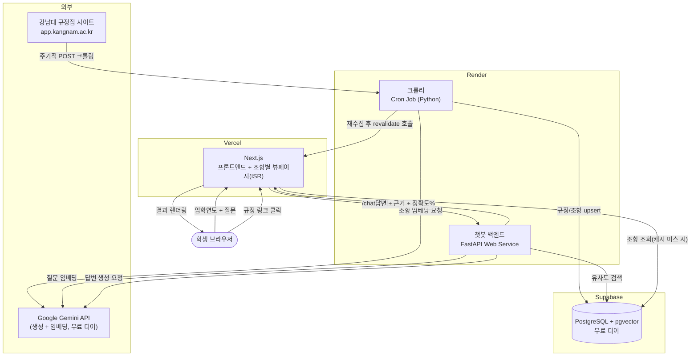
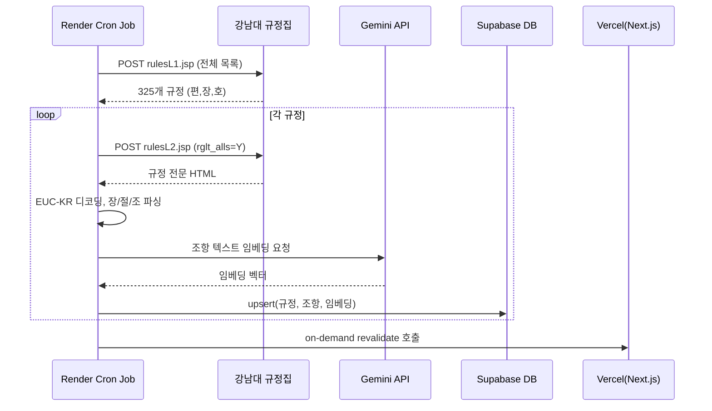
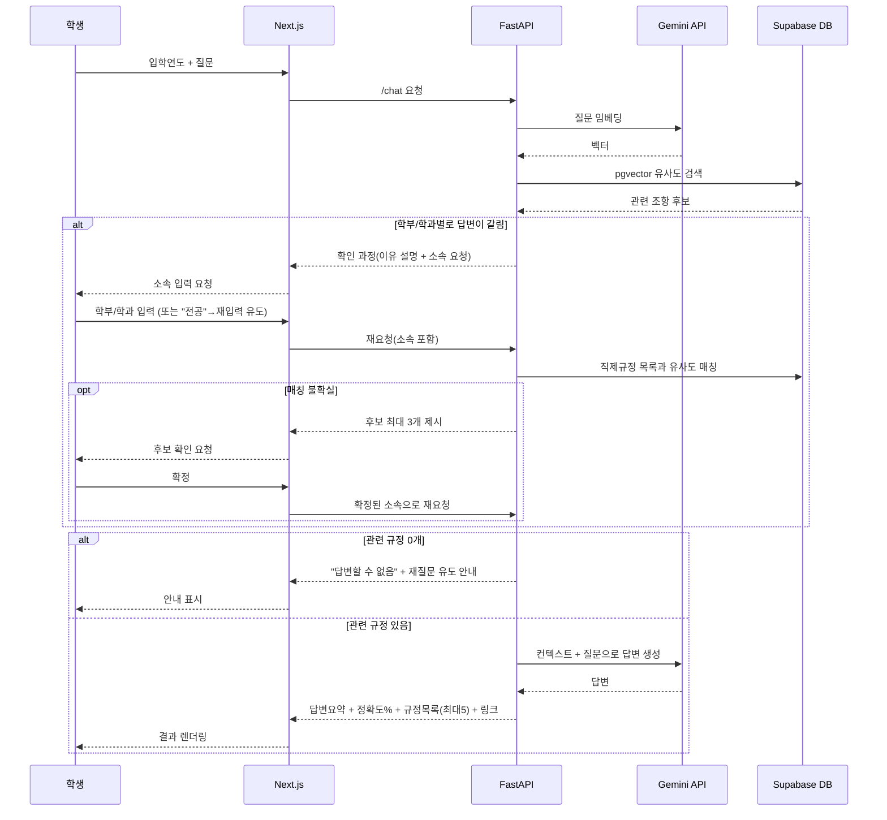
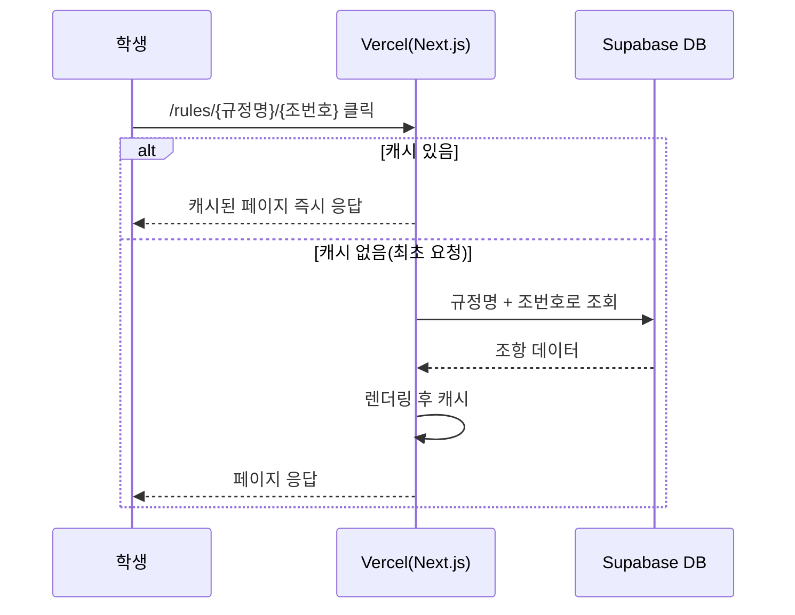
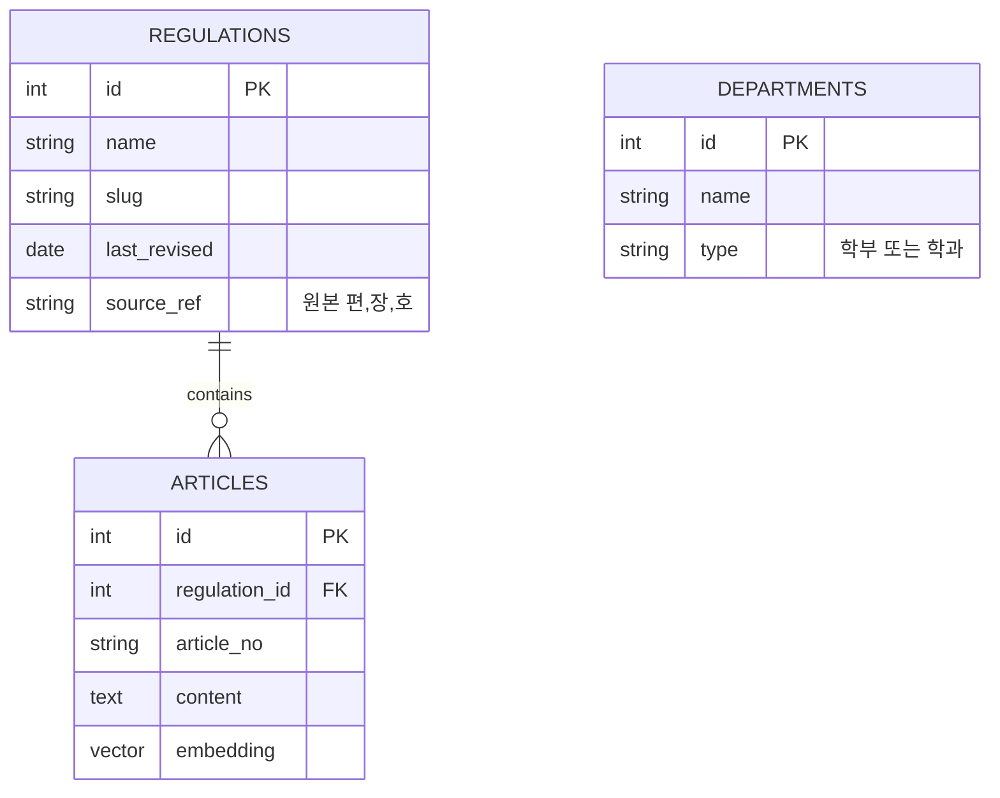

# 아키텍처: 강남대 규정집 챗봇 (RuleMoa)

> 개발 착수 전 전체 시스템 구조를 정리한 문서. 기술 스택/배포 결정은 [PLANNING.md](PLANNING.md), 기능 요구사항은 [PRD.md](PRD.md) 참고.

## 1. 전체 시스템 구성도

## 2. 컴포넌트 역할

| 컴포넌트 | 배포 위치 | 역할 |
|---|---|---|
| 크롤러 | Render Cron Job | 규정집 주기 재수집, EUC-KR 디코딩, 편/장/절/조 구조 파싱, DB upsert |
| 챗봇 백엔드 | Render Web Service (FastAPI) | 질문 임베딩, pgvector 검색, LLM 호출, 확인 과정/학부 매칭/정확도 산출 |
| DB | Supabase (Postgres + pgvector) | 규정·조항·학부/학과 데이터, 임베딩 벡터 |
| 프론트엔드 | Vercel (Next.js) | 입력 UI, 응답 렌더링, 조항별 뷰페이지(ISR) |
| LLM/임베딩 | Google Gemini API | 임베딩 생성, 답변 생성 |

## 3. 핵심 흐름

### 3-1. 크롤링 파이프라인 (배치)

### 3-2. 챗봇 질의응답 (기본/예외 플로우)

### 3-3. 조항별 뷰페이지 (ISR, 온디맨드)

## 4. 데이터 모델 (초안)

정식 스키마(컬럼 타입, 인덱스 등)는 구현 단계에서 확정.

## 5. 배포 경계 요약

- **Vercel**: Next.js만 배포 (프론트엔드 + 조항별 뷰페이지)
- **Render**: FastAPI(상시 구동, DB 커넥션 풀 유지) + 크롤러(Cron Job)
- **Supabase**: Postgres + pgvector, 무료 티어
- **Google**: Gemini API, 무료 티어 (초과 시 서비스 응답 중단)

각 선택의 근거는 [PLANNING.md §5 배포 아키텍처](PLANNING.md#5-배포-아키텍처) 참고.

## 6. 다음 개발 순서 (제안)

1. Supabase 프로젝트 생성 + pgvector 익스텐션 활성화 + 스키마 마이그레이션
2. 크롤러 프로토타입 (rulesL1/rulesL2 파싱 → 로컬 검증)
3. 임베딩 파이프라인 연동 (Gemini Embedding API) + DB upsert
4. FastAPI 챗봇 API (검색 + 생성 + 확인 과정/학부 매칭 로직)
5. Next.js 프론트엔드 (입력 폼 + 응답 렌더링)
6. 조항별 뷰페이지 (ISR)
7. Render/Vercel/Supabase 배포 연결 + e2e 테스트
